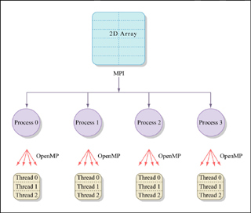
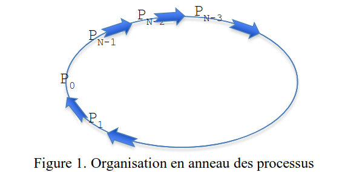
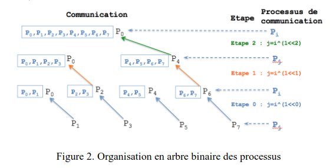
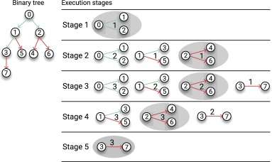

# TP2
##  1. MPI (Message Passing Interface)
**Message Passing Interface (MPI)** est un outil pour le calcul scientifique à haute performance qui permet d'utiliser plusieurs ordinateurs.



Un communicateur désigne un ensemble de processus pouvant communiquer ensemble, et deux processus ne pourront communiquer que s'ils sont dans un même communicateur. 

Un communicateur initial englobe tous les processus (**MPI_COMM_WORLD**), qu'il est possible de subdiviser en communicateurs plus petits correspondant à des entités logiques. 

Il existe deux types de communicateurs : les intracommunicateurs et les intercommunicateurs. 
- Les intracommunicateurs sont les communicateurs standards, alors que les intercommunicateurs servent à créer un pont entre deux intracommunicateurs. 

MPI-2 améliore grandement l'usage des intercommunicateurs en leur permettant de réaliser des communications collectives.
### 2. Programmation : qui suis-je ?

- Compilation :

`m̀picc -o hello_mpi hello_mpi.c`

- Exécution avec 8 processus :

`mpiexec -np 8 ./hello_mpi`

Sortie standard : 
```
Hello from process 0 of 8 running on node rsegerie-Inspiron-15-3520, core 0
Hello from process 2 of 8 running on node rsegerie-Inspiron-15-3520, core 7
Hello from process 4 of 8 running on node rsegerie-Inspiron-15-3520, core 9
Hello from process 6 of 8 running on node rsegerie-Inspiron-15-3520, core 4
Hello from process 1 of 8 running on node rsegerie-Inspiron-15-3520, core 6
Hello from process 3 of 8 running on node rsegerie-Inspiron-15-3520, core 3
Hello from process 5 of 8 running on node rsegerie-Inspiron-15-3520, core 10
Hello from process 7 of 8 running on node rsegerie-Inspiron-15-3520, core 11
```
### 3. Communication point à point (p2p)

- Compilation :

`mpicc -o p2p p2p.c`

- Exécution avec 8 processus : 

`m̀piexec -np 8 ./p2p`

Sortie standard avant modification : 
```
Bonjour de la part de P1!
Bonjour de la part de P2!
Bonjour de la part de P3!
Bonjour de la part de P4!
Bonjour de la part de P5!
Bonjour de la part de P6!
Bonjour de la part de P7!
```

Sortie standard après modification : 
```
Bonjour de la part de P7!
Bonjour de la part de P2!
Bonjour de la part de P5!
Bonjour de la part de P1!
Bonjour de la part de P3!
Bonjour de la part de P6!
Bonjour de la part de P4!
```

Avant modification : les messages sont reçus séquentiellement se l'ordre défini par la boucle `for`.
Après modification : l'ordre d'affiche des messages peut varier selon la rapidité de chaque envoi/réception.

### 3. Modification du deuxième exemple "p2p.c"

Le message de $P_{N-1}$ est envoyé à $P_{N-2}$, concaténé au message de $P_{N-2}$, puis $P_{N-2}$ envois le message à $P_{N-3}$, ainsi de suite jusqu'à $P_{0}$.

#### Communication en anneau

Chaque processus $P(i)$ envoie son message à $P(i-1)$, sauf $P_0$, qui affiche le message final.


Sortie standard : 
```
Message final : Bonjour de la part de P7, P6, P5, P4, P3, P2, P1, P0 !
```
#### Communication en arbre binaire




Les processus suivent une structure binaire : $P_0$ reçoit les messages de $P_1$, $P_2$, $P_4$, etc.

L'idée derrière cette formule repose sur la numérotation binaire et le modèle de communication en arbre binaire.
Un arbre binaire fonctionne en niveaux successifs.

À chaque étape j, nous regroupons les processus par paires basées sur leurs indices.
À chaque niveau j (où step = $2^j$), seuls certains processus restent actifs pour recevoir les données.

Le processus récepteur doit être celui dont le rang est un multiple de 2 * step, afin d'assurer une structure régulière.

*Exemple* : 
```
Étape 0 (step = 1) :
P1 → P0
P3 → P2
P5 → P4
P7 → P6

       P0      P2      P4      P6
       ↑       ↑       ↑       ↑
      P1      P3      P5      P7


Étape 1 (step = 2) :
P2 → P0
P6 → P4

         P0      P4
        /  \    /   \ 
      P2     P6     P5
     /  \     ↑
   P3    P1  P7


Étape 2 (step = 4) :
P4 → P0

          P0
        /    \
      P4       P2
     /  \     /   \
   P6   P5   P3   P1
  /        
P7        
```

Sortie standard : 
```
P0, P1, P2, P3, P4, P5, P6, P7!
```