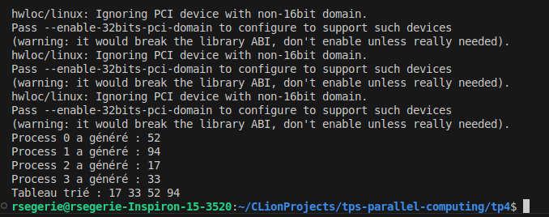

# TP MPI 4 : Tri parallèle - communication locale & collective

Le but de ce TP est d'implémenter un algorithme de tri parallèle pair-impair en utilisant MPI.

### Principe du tri parallèle pair-impair
Le tri pair-impair est une variante du tri à bulles où les comparaisons et échanges sont divisés en 2 phases : 
1. Comparaison des éléments d'**indices pairs** avec leurs voisins directs.

2. Compairaison des éléments d'**indices impairs** avec leurs voisins directs.

### Compilation & exécution
```
mpicc -o tri_mpi main.c  
mpirun -np 4 ./main
```
